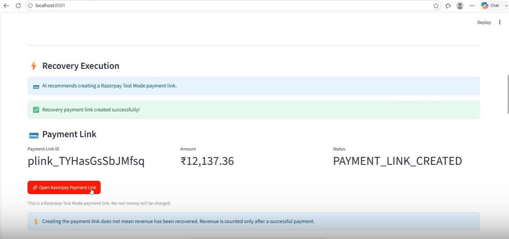
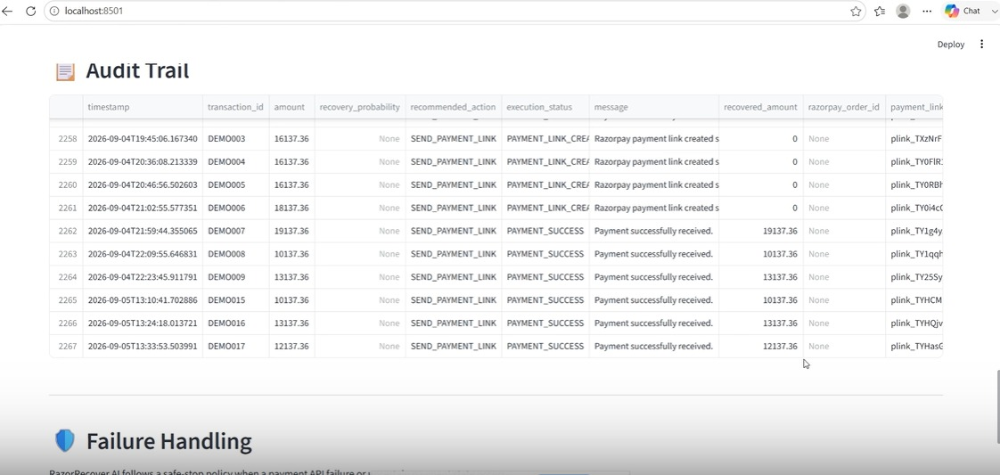

# 🚀 RazorRecover AI

### AI-Powered Payment Recovery & Revenue Recovery Agent

**Predict → Decide → Guard → Execute → Verify → Audit**

RazorRecover AI is an AI-assisted payment recovery platform that analyzes at-risk transactions, predicts their recovery probability, selects an appropriate intervention, applies safety guardrails, and executes controlled recovery workflows.

The system integrates with **Razorpay Test Mode** for payment-link creation and payment verification, while simulated recovery paths demonstrate retry and escalation decisions.

---

## 🎯 Problem

Payment failures can result in significant revenue loss, but **not every failed transaction should be handled in the same way**.

Blindly retrying payments can lead to unnecessary attempts, duplicate execution, or inappropriate automated actions.

RazorRecover AI addresses this by combining **machine-learning-based recovery prediction** with **rule-based intervention strategies and safety guardrails**.

---

## 💡 Solution

For every at-risk transaction, RazorRecover AI follows a controlled decision pipeline:

```text
Transaction
     ↓
AI Recovery Prediction
     ↓
Intervention Strategy
     ↓
Policy & Safety Guardrails
     ↓
Recovery Execution
     ↓
Payment Verification
     ↓
Audit Trail
```

Based on transaction context and predicted recovery probability, the system can recommend:

* 🔄 **Retry Payment**
* 💳 **Send Payment Link**
* 🔔 **Reminder / Recovery Recommendation**
* 👤 **Escalate for Manual Handling**
* ⏸️ **No Action**

---

## ✨ Key Features

| Feature                           | Description                                                                |
| --------------------------------- | -------------------------------------------------------------------------- |
| 🧠 AI Recovery Prediction         | Predicts the probability of successfully recovering an at-risk transaction |
| 🎯 Intervention Strategy          | Selects an appropriate recovery action based on transaction conditions     |
| 🛡️ Retry Limit Guardrail         | Prevents automated retries after the configured retry limit                |
| 🚫 Duplicate Execution Protection | Prevents repeated successful execution of the same recovery action         |
| 💳 Razorpay Test Mode             | Creates real Test Mode payment links                                       |
| ✅ Payment Verification            | Verifies payment status after payment-link recovery                        |
| 👤 Safe Escalation                | Stops automation when manual intervention is more appropriate              |
| 📋 Audit Trail                    | Records recovery actions and execution results                             |
| 📊 Streamlit Dashboard            | Provides an interactive interface for analysis and recovery execution      |
| ⚠️ Failure Handling               | Safely handles failed or interrupted recovery execution                    |

---

## 🧠 Machine Learning Model

The recovery prediction model is trained using historical transaction data and predicts whether an at-risk transaction is likely to be recovered.

### Model Performance

| Metric      |      Score |
| ----------- | ---------: |
| 🎯 Accuracy |    **90%** |
| 📈 ROC-AUC  | **0.9563** |

The predicted recovery probability is passed to the intervention strategy, which combines the model output with transaction conditions and recovery policies to determine the next action.

---

## 🏗️ System Architecture


### Recovery Pipeline

```text
┌─────────────────────┐
│ Transaction Dataset │
└──────────┬──────────┘
           ↓
┌─────────────────────┐
│ AI Recovery Analyzer│
│ Recovery Prediction │
└──────────┬──────────┘
           ↓
┌─────────────────────┐
│ Intervention Strategy│
│ Action Selection     │
└──────────┬──────────┘
           ↓
┌─────────────────────┐
│ Policy & Guardrails │
│ Retry / Duplicate   │
│ Protection          │
└──────────┬──────────┘
           ↓
┌─────────────────────┐
│ Recovery Executor   │
└──────────┬──────────┘
           ↓
┌─────────────────────┐
│ Payment Verification│
└──────────┬──────────┘
           ↓
┌─────────────────────┐
│ Audit Trail         │
└─────────────────────┘
```

---

## 🎬 Demo Scenarios

### 💳 1. Payment Link Recovery

When a payment-link intervention is selected:

```text
Analyze
   ↓
Predict
   ↓
SEND_PAYMENT_LINK
   ↓
Guardrail Check
   ↓
Create Razorpay Test Payment Link
   ↓
Complete Test Payment
   ↓
Verify Payment
   ↓
Record Audit Result
```

The payment-link workflow uses **Razorpay Test Mode** to create a test payment link and verify the resulting payment status.

---

### 🔄 2. Payment Retry

For eligible transactions with a sufficiently high recovery probability and within the configured retry limit, the system can recommend:

```text
RETRY_PAYMENT
```

> ⚠️ **Prototype limitation:** The current retry execution is simulated using the dataset's `recovered` field. It does not perform a real Razorpay payment retry.

This allows the retry decision-making workflow to be demonstrated without attempting unsupported production payment operations.

---

### 👤 3. Escalation

When automated recovery is not appropriate, the system recommends:

```text
ESCALATE
```

No automatic payment action is performed.

This provides a **safe-stop mechanism** instead of forcing an automated recovery attempt.

---

## 🛡️ Safety & Reliability

RazorRecover AI is designed around controlled automation rather than blindly executing recovery actions.

### 🔄 Retry Limit Protection

Transactions that have reached the configured retry limit are prevented from being automatically retried.

### 🚫 Duplicate Execution Protection

Before executing a recovery action, the system checks the audit trail for a previous successful execution of the same transaction and action.

This helps prevent duplicate recovery execution.

### 👤 Escalation

When automated recovery is unsuitable, the system stops the automated action and escalates the transaction for manual handling.

### 🔐 Credential Protection

Razorpay credentials are loaded through environment variables and are **not hard-coded into the application**.

The `.env` file is excluded from Git using `.gitignore`.

---

## 📊 Streamlit Dashboard

RazorRecover AI includes an interactive Streamlit dashboard for demonstrating the complete recovery workflow.

### Dashboard Includes

* 💰 Revenue at Risk
* 💵 Revenue Recovered
* 📈 Recovery Rate
* 🔴 At-Risk Transactions
* 🧠 AI Recovery Analysis
* 🎯 Intervention Strategy
* ⚡ Recovery Execution
* 💳 Razorpay Payment-Link Flow
* ✅ Payment Status Verification
* 📋 Audit Trail
* 🛡️ Failure Handling

The dashboard allows a transaction to be analyzed first, followed by the recommended recovery action and its controlled execution.

---

## 📸 Application Preview

### 🏠 Recovery Dashboard


### 💳 Payment Link Recovery



### 📋 Audit Trail



---

## 🛠️ Tech Stack

| Category               | Technology             |
| ---------------------- | ---------------------- |
| 🐍 Language            | Python                 |
| 🧠 Machine Learning    | scikit-learn           |
| 📊 Data Processing     | pandas                 |
| 🌐 Web Application     | Streamlit              |
| 💳 Payment Integration | Razorpay Test Mode API |
| 🔐 Configuration       | python-dotenv          |
| 💾 Model Storage       | joblib                 |
| 📁 Data Storage        | CSV                    |

---

## 📂 Project Structure

```text
RazorRecover-AI/
│
├── app.py
├── README.md
├── .gitignore
│
├── backend/
│   ├── agent.py
│   ├── batch_recovery.py
│   ├── failure_handler.py
│   ├── policies.py
│   ├── razorpay_service.py
│   ├── recovery.py
│   ├── recovery_executor.py
│   └── test_*.py
│
├── data/
│   ├── transactions.csv
│   ├── audit_trail.csv
│   └── generate_data.py
│
├── models/
│   ├── recovery_model.pkl
│   └── train_model.py
│
├── docs/
│   ├── architecture.png
│   ├── dashboard.png
│   ├── payment-link..jpg
│   └── audit-trail.jpg
│
└── check_probabilities.py
```

---

## ⚙️ Installation & Setup

### 1️⃣ Clone the Repository

```bash
git clone https://github.com/likithan369-hub/RazorRecover-AI.git
cd RazorRecover-AI
```

### 2️⃣ Create a Virtual Environment

```bash
python -m venv venv
```

### 3️⃣ Activate the Environment

**Windows:**

```powershell
venv\Scripts\activate
```

**macOS / Linux:**

```bash
source venv/bin/activate
```

### 4️⃣ Install Dependencies

```bash
pip install -r requirements.txt
```

### 5️⃣ Configure Razorpay Test Mode

Create a `.env` file in the project root:

```env
RAZORPAY_KEY_ID=your_test_key_id
RAZORPAY_KEY_SECRET=your_test_key_secret
```

⚠️ **Never commit or upload `.env` to GitHub.**

The repository's `.gitignore` already excludes it.

### 6️⃣ Run the Application

```bash
streamlit run app.py
```

The Streamlit dashboard will then be available locally.

---

## ⚠️ Current Limitations

This project is a **working buildathon prototype**.

The following are not currently implemented:

* ❌ Real Razorpay payment-retry API
* ❌ Email notifications
* ❌ SMS notifications
* ❌ WhatsApp notifications
* ❌ Real-time transaction streaming
* ❌ Production payment processing
* ❌ Database-backed audit storage
* ❌ Customer-impact scoring
* ❌ Time-window recovery checks
* ❌ Reinforcement learning

The `RETRY_PAYMENT` path is currently simulated using the dataset's `recovered` field.

The `SEND_PAYMENT_LINK` workflow uses Razorpay Test Mode for payment-link creation and payment verification.

---

## 🚀 Future Improvements

Potential future extensions include:

* 🔄 Production payment-retry workflow integration
* 📩 Email/SMS notification integration
* 🗄️ Database-backed audit storage
* ⚡ Real-time transaction processing
* 🧠 More advanced recovery policies
* 📊 Recovery strategy monitoring
* 🤖 Improved intervention optimization using historical outcomes
* 📈 Recovery analytics and business-impact monitoring

These are proposed extensions and are **not part of the current implementation**.

---

## 🎬 Demo Video

📹 **Loom Demo:**
https://www.loom.com/share/557969dde882493a891a2be0bf564994

The demo covers:

* 🧠 AI recovery analysis
* 💳 Payment-link recovery
* 🔄 Retry decision
* 👤 Escalation
* 🛡️ Duplicate and retry safeguards
* 📋 Audit trail
* ✅ Payment verification

---

## 💡 Core Concept

RazorRecover AI follows a simple principle:

```text
🧠 Predict
     ↓
🎯 Decide
     ↓
🛡️ Guard
     ↓
⚡ Execute
     ↓
✅ Verify
     ↓
📋 Audit
```

Instead of applying the same recovery action to every failed payment, the system uses transaction context and predicted recovery probability to select a more appropriate recovery path.

---

## 🏁 Project Status

### ✅ Working Prototype — Buildathon Demo

RazorRecover AI currently demonstrates:

* ✅ ML-based recovery prediction
* ✅ AI-assisted intervention selection
* ✅ Retry-limit protection
* ✅ Duplicate execution protection
* ✅ Razorpay Test Mode payment-link creation
* ✅ Payment verification
* ✅ Recovery execution
* ✅ Safe escalation
* ✅ Audit trail
* ✅ Interactive Streamlit dashboard

---

## 👩‍💻 Built For

**Buildathon Project — RazorRecover AI**

> **Turning payment failures into controlled recovery opportunities. 🚀**
