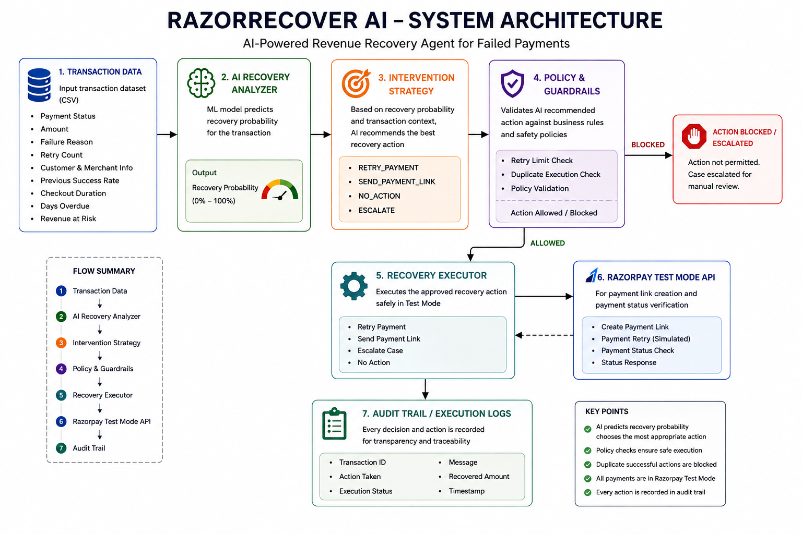
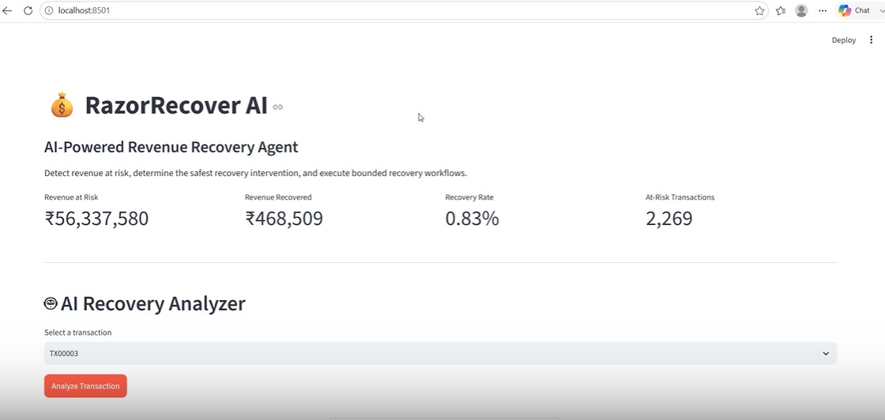

# 🚀 RazorRecover AI

### 🧠 AI-Powered Payment Recovery & Revenue Recovery Agent

 **Predict → Decide → Guard → Execute → Verify → Audit**

RazorRecover AI is an AI-assisted payment recovery system that analyzes
at-risk transactions, predicts their recovery probability, selects an
appropriate intervention, applies safety guardrails, and executes the
recovery workflow using Razorpay Test Mode where applicable.

---

## 🌟 Why RazorRecover AI?

Failed payments don't all need the same recovery strategy.

Instead of blindly retrying every failed transaction, RazorRecover AI
uses machine-learning predictions and rule-based intervention logic to
decide whether a transaction should be:

🔄 **Retried**  
💳 **Recovered through a payment link**  
🔔 **Recommended for a reminder**  
👤 **Escalated for manual handling**

---

## ✨ Key Features

| Feature | Description |
| 🧠 AI Recovery Prediction | Predicts the probability of recovering an at-risk transaction |
| 🎯 Intervention Strategy | Selects a recovery action based on transaction conditions |
| 🛡️ Retry Limit Guardrail | Prevents automated retries after the configured retry limit |
| 🚫 Duplicate Protection | Blocks repeated successful recovery execution |
| 💳 Razorpay Test Mode | Creates real Test Mode payment links |
| ✅ Payment Verification | Verifies whether a generated payment link was paid |
| 📋 Audit Trail | Records recovery execution and payment results |
| 👤 Escalation | Safely stops automation when recovery should be handled manually |
| 📊 Streamlit Dashboard | Provides an interactive interface for analysis and execution |

---

## 🏆 Model Performance

The recovery prediction model was evaluated on a held-out test set.

| Metric      | Score      |
| 🎯 Accuracy | **90%**    |
| 📈 ROC-AUC  | **0.9563** |

The model predicts the probability that a revenue-at-risk transaction can be successfully recovered, which is then used by the intervention strategy to select an appropriate recovery action.

## 🏗️ System Architecture



The system follows a controlled recovery pipeline:

**Transaction Data**
→ **AI Recovery Analyzer**
→ **Intervention Strategy**
→ **Policy & Guardrails**
→ **Recovery Executor**
→ **Payment Verification**
→ **Audit Trail**


## 🎬 Demo Scenarios

### 💳 1. Payment Link Recovery

The AI identifies a transaction where a payment link is more appropriate.

**Flow:**

`Analyze → Predict → SEND_PAYMENT_LINK → Guardrail Check → Create Link → Test Payment → Verify → Audit`

The payment link is created through Razorpay Test Mode.  
A payment is then completed in Test Mode and verified through the application.

---

### 🔄 2. Payment Retry

For transactions with a sufficiently high recovery probability and
within the retry limit, the system can recommend:

`RETRY_PAYMENT`

> ⚠️ The current retry execution is simulated using the dataset's
> `recovered` field. It does not perform a real Razorpay payment retry.

---

### 👤 3. Escalation

When automated recovery is not appropriate, the system recommends:

`ESCALATE`

No automatic payment action is performed.

This provides a safe-stop mechanism instead of forcing an automated recovery.

---

## 🖥️ Streamlit Dashboard

RazorRecover AI provides an interactive Streamlit dashboard where the complete recovery workflow can be demonstrated.

### 📊 Dashboard includes:

- 💰 Revenue at Risk
- 💵 Revenue Recovered
- 📈 Recovery Rate
- 🔴 At-Risk Transactions
- 🧠 AI Recovery Analysis
- 🎯 Intervention Strategy
- ⚡ Recovery Execution
- 💳 Razorpay Payment Link Flow
- ✅ Payment Status Verification
- 📋 Audit Trail
- 🛡️ Failure Handling

The dashboard allows a transaction to be analyzed first, followed by the recommended recovery action and its controlled execution.

---

## 📸 Application Preview


### 🏠 Recovery Dashboard




### 💳 Payment Link Recovery


### 📋 Audit Trail


---

## 🛠️ Tech Stack

| Category | Technology |
|---|---|
| 🐍 Language | Python |
| 🧠 Machine Learning | scikit-learn |
| 📊 Data Processing | pandas |
| 🌐 Web Application | Streamlit |
| 💳 Payment Integration | Razorpay Test Mode API |
| 🔐 Configuration | python-dotenv |
| 💾 Model Storage | joblib |
| 📁 Data Storage | CSV |

---

## 🌟 Key Highlights

- 🤖 ML-powered recovery prediction
- 🎯 Context-aware recovery strategy selection
- 🛡️ Built-in retry and duplicate-execution safeguards
- 💳 Razorpay Test Mode payment-link integration
- ✅ Payment verification after link-based recovery
- 👤 Safe escalation for high-risk cases
- 📋 Complete recovery audit trail
- 📊 Interactive Streamlit dashboard

## 📂 Project Structure

```text
RazorRecover-AI/
│
├── app.py
│
├── backend/
│   ├── agent.py
│   ├── policies.py
│   ├── recovery_executor.py
│   └── ...
│
├── data/
│   ├── transactions.csv
│   └── audit_trail.csv
│
├── models/
│   └── recovery_model.pkl
│
├── docs/
│   └── architecture.png
│
├── .env
├── requirements.txt
└── README.md

⚙️ Installation & Setup
1️⃣ Clone the repository
cd RazorRecover-AI
2️⃣ Create a virtual environment
python -m venv venv
3️⃣ Activate the environment

Windows:

venv\Scripts\activate
4️⃣ Install dependencies
pip install -r requirements.txt
5️⃣ Configure Razorpay Test Mode

Create a .env file in the project root:

RAZORPAY_KEY_ID=your_test_key_id
RAZORPAY_KEY_SECRET=your_test_key_secret

⚠️ Never upload this file to GitHub.

6️⃣ Run the application
streamlit run app.py

🛡️ Security & Safety

RazorRecover AI includes several controls to prevent unsafe or repeated automated actions.

🔄 Retry Limit

Transactions that have reached the configured retry limit are not automatically retried.

🚫 Duplicate Execution Protection

The system checks the audit trail before executing an action and blocks duplicate successful executions for the same transaction and action.

👤 Escalation

When automated recovery is not appropriate, the system safely stops the automated payment action and escalates the case.

🔐 Credential Protection

Razorpay credentials are loaded through environment variables rather than being hard-coded into the application.

⚠️ Current Limitations

This version is a working prototype/buildathon implementation.

The following are not currently implemented:

❌ Real Razorpay payment-retry API
❌ Email notifications
❌ SMS notifications
❌ WhatsApp notifications
❌ Real-time transaction streaming
❌ Production payment processing
❌ Database-backed audit storage
❌ Customer-impact scoring
❌ Time-window recovery checks
❌ Reinforcement learning

The RETRY_PAYMENT path is currently simulated using the dataset's recovered field.

The SEND_PAYMENT_LINK workflow uses Razorpay Test Mode for actual test payment-link creation and payment verification.

🚀 Future Improvements

Possible future extensions include:

🔄 Integration with a production payment-retry workflow
📩 Email/SMS notification integration
🗄️ Database-backed audit storage
⚡ Real-time transaction processing
🧠 More advanced recovery policies
📊 Recovery strategy monitoring
🤖 Improved intervention optimization using historical outcomes

These are proposed future improvements and are not part of the current implementation.

🎬 Demo Video
📹 Loom

Demo: <https://www.loom.com/share/557969dde882493a891a2be0bf564994>

The demo covers:

🧠 AI recovery analysis
💳 Payment-link recovery
🔄 Retry decision
👤 Escalation
🛡️ Duplicate/retry safeguards
📋 Audit trail
✅ Payment verification
💡 Core Concept

RazorRecover AI follows a simple principle:

🧠 Predict
     ↓
🎯 Decide
     ↓
🛡️ Guard
     ↓
⚡ Execute
     ↓
✅ Verify
     ↓
📋 Audit

Instead of applying the same recovery action to every failed payment, the system uses the transaction context and predicted recovery probability to select a more appropriate recovery path.

🏁 Project Status
✅ Working Prototype — Buildathon Demo

RazorRecover AI currently demonstrates:

✅ ML-based recovery prediction
✅ AI-driven intervention selection
✅ Retry-limit protection
✅ Duplicate execution protection
✅ Razorpay Test Mode payment-link creation
✅ Payment verification
✅ Recovery execution
✅ Escalation
✅ Audit trail
✅ Interactive Streamlit dashboard

👩‍💻 Built For

Buildathon Project — RazorRecover AI

Turning payment failures into controlled recovery opportunities. 🚀


